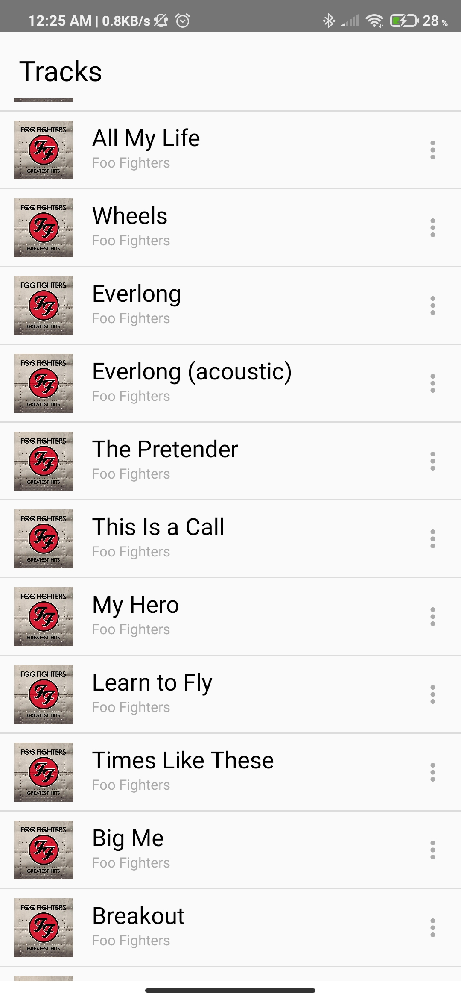
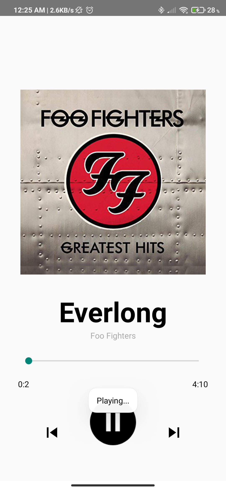

# Lightweight Android Music Player 

A lightweight music player made with Java in android studio. 

## Overview
The app consists of two activities 
MainActivity displays your local saved audio Tracks.
PlayerActivity manages playing your selected Track.

    

### Prerequisites

Have Android Studio installed

## Deployment

Just build and install the apk on your android device and you are good! 
Dont forget to allow reading permissions.
## Built With

* [Android Studio](https://developer.android.com/studio)

